# SQL Agent OSS

**Agente SQL open source con arquitectura de capa semántica para analistas de negocio**  
_Un sistema compuesto de IA para conversión segura y semántica de lenguaje natural a SQL_

## 🎯 El Problema

Las herramientas tradicionales de "chat con tu base de datos" fallan en entornos empresariales porque:

- **No entienden la semántica del negocio** (¿Qué significa "ingresos netos" aquí?)
- **Crean riesgos de seguridad** (Conexiones directas LLM-a-DB son peligrosas)
- **Carecen de robustez** (Enfoques one-shot fallan en consultas complejas)
- **Ignoran la brecha semántica** entre nombres de columnas y conceptos de negocio

## ✨ La Solución

SQL Agent OSS implementa una arquitectura de **Sistema de IA Compuesto** con:

- **Capa Semántica**: Definiciones de negocio y mapeos de KPIs (no solo DDL crudo)
- **Seguridad por Diseño**: Validación basada en AST con SQLGlot, solo lectura
- **Auto-Corrección**: Bucles de recuperación de errores con LangGraph
- **Multi-Base de Datos**: Soporte para PostgreSQL & MySQL desde el inicio
- **Arquitectura Asíncrona**: Alta concurrencia con asyncpg y FastAPI

## 🏗️ Arquitectura

```mermaid
graph TD
    Usuario[👤 Pregunta del Usuario] --> Semantica[📚 Capa Semántica]
    Semantica -->|Contexto Enriquecido| Grafo[🔄 LangGraph StateGraph]

    subgraph "Bucle de Razonamiento"
        Grafo --> Generar[✍️ Generación SQL]
        Generar --> Validar[🛡️ Validación AST]
        Validar -->|❌ Inseguro| Generar
        Validar -->|✅ Seguro| Ejecutar[⚡ Ejecución Consulta]
        Ejecutar -->|❌ Error DB| Corregir[🔧 Auto-Corrección]
        Corregir --> Generar
    end

    Ejecutar -->|✅ Resultados| Sintetizar[💬 Respuesta en Lenguaje Natural]
    Sintetizar --> Usuario[👤 Respuesta]
```

