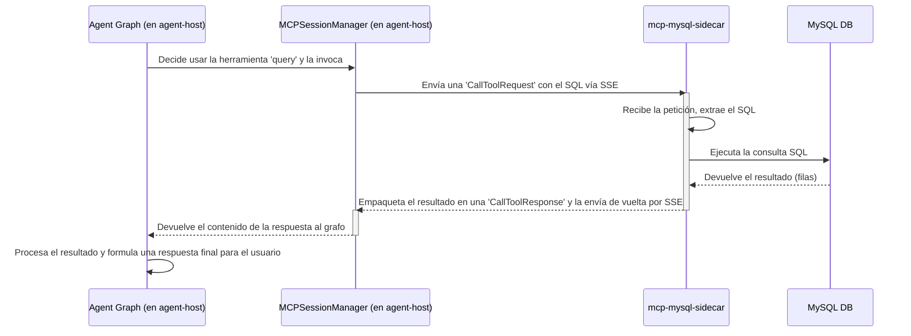

# Arquitectura de Componentes y Comunicación (MCP)

## 1. Introducción

Este documento describe la arquitectura de comunicación interna del proyecto, que se basa en el **Model Context Protocol (MCP)**. MCP es un protocolo estándar que permite que un agente de IA (el "cliente") se comunique de forma segura y estandarizada con sus herramientas (los "servidores"), incluso si estas se ejecutan en procesos, contenedores o máquinas diferentes.

Gracias a MCP, nuestro `agent-host` (el cerebro) está completamente desacoplado de la lógica y las credenciales de sus herramientas, como la base de datos.

## 2. Componentes del Ecosistema MCP

La arquitectura actual consta de dos componentes principales que se comunican vía MCP:

### 2.1. `agent-host` (El Cliente MCP)

-   **Rol:** Actúa como el **cliente** en la comunicación MCP. Es el orquestador que *consume* las herramientas expuestas por los sidecars.
-   **Implementación Clave:** La lógica del cliente se encuentra en `apps/agent-host/src/infra/mcp/manager.py`.
-   **`MCPSessionManager`:** Esta clase es el corazón del cliente. Se encarga de establecer una conexión persistente y resiliente (con reintentos automáticos) a los servidores MCP mediante Server-Sent Events (SSE). No contiene ninguna credencial sensible.

### 2.2. `mcp-mysql-sidecar` (El Servidor MCP)

-   **Rol:** Actúa como el **servidor** en la comunicación MCP. Es un microservicio que *expone* una o más herramientas.
-   **Implementación Clave:** La lógica del servidor se encuentra en `services/mcp-mysql-sidecar/src/index.ts`.
-   **Herramienta `query`:** Este servicio expone una única herramienta llamada `query`, que acepta un string SQL como argumento.
-   **Aislamiento de Secretos:** Este contenedor es el **único** que posee las credenciales de la base de datos (`MYSQL_USER`, `MYSQL_PASSWORD`, etc.). El agente principal no tiene conocimiento alguno de ellas, cumpliendo con el Principio de Mínimo Privilegio.

## 3. Flujo de una Consulta SQL vía MCP

Cuando un usuario pide un dato que requiere una consulta a la base de datos, ocurre el siguiente flujo de comunicación:



## 4. Detalles de Implementación Clave

### 4.1. Lógica del Cliente (`manager.py`)

El `MCPSessionManager` utiliza `sse_client` del SDK de MCP para establecer la conexión. La gestión de la conexión y su ciclo de vida se maneja con `AsyncExitStack` para asegurar que los recursos de red se liberen correctamente, incluso si hay errores.

```python
# apps/agent-host/src/infra/mcp/manager.py (Extracto)

class MCPSessionManager:
    # ...
    async def connect(self):
        """Establece la conexión inicial con el sidecar MCP."""
        self._exit_stack = AsyncExitStack()
        # ...
        sse = sse_client(url=f"{self.sidecar_url}/sse", timeout=None)
        streams = await self._exit_stack.enter_async_context(sse)
        
        self.session = await self._exit_stack.enter_async_context(
            ClientSession(streams[0], streams[1])
        )
        await self.session.initialize()
    # ...
```

### 4.2. Lógica del Servidor (`index.ts`)

El sidecar de Node.js utiliza el `@modelcontextprotocol/sdk` para crear un servidor MCP. Define la herramienta `query`, su descripción y los parámetros que espera (`inputSchema`). La lógica de ejecución real se maneja dentro del `setRequestHandler`, donde se utiliza un pool de conexiones de MySQL para ejecutar la consulta recibida.

```typescript
// services/mcp-mysql-sidecar/src/index.ts (Extracto)

// ...
const server = new Server(
    { name: "mysql-sidecar", version: "1.0.0" },
    { capabilities: { tools: {} } }
);

// Define la herramienta 'query'
server.setRequestHandler(ListToolsRequestSchema, async () => {
    return {
        tools: [
            {
                name: "query",
                description: "Execute a SQL query",
                inputSchema: {
                    type: "object",
                    properties: { sql: { type: "string" } },
                    required: ["sql"],
                },
            },
        ],
    };
});

// Define cómo se ejecuta la herramienta 'query'
server.setRequestHandler(CallToolRequestSchema, async (request) => {
    if (request.params.name === "query") {
        const sql = request.params.arguments?.sql;
        // ... validación ...
        const [rows] = await pool.execute(sql); // Ejecuta el SQL
        return {
            content: [{ type: "text", text: JSON.stringify(rows, null, 2) }],
        };
    }
    // ... manejo de errores ...
});
// ...
```

Esta arquitectura distribuida y basada en un protocolo estándar proporciona una base robusta, segura y escalable para el `SQL Agent OSS`.